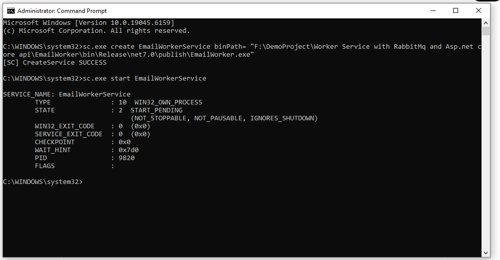
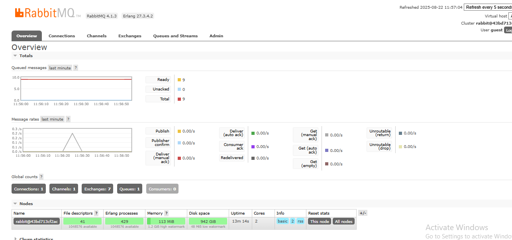
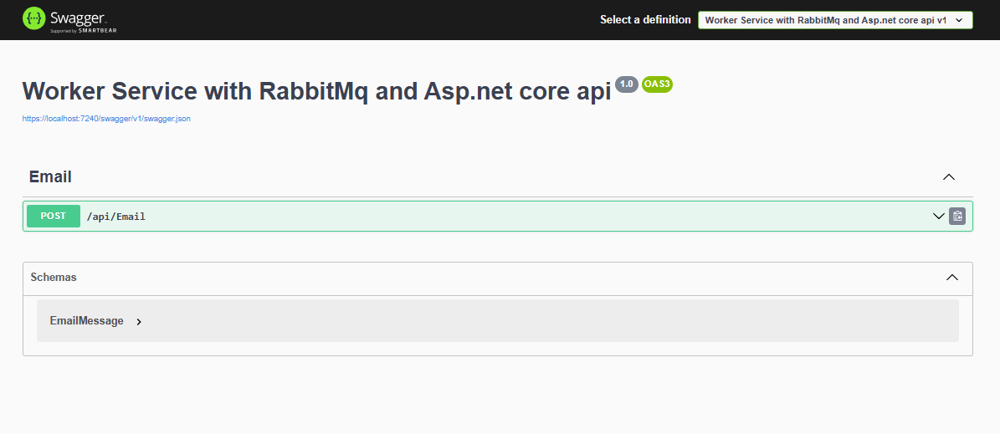

# 📧 EmailQueueWithRabbitMQ

A robust ASP.NET Core demo showcasing how to send emails using a **Web API**, a **RabbitMQ message queue**, and a **.NET Worker Service** hosted as a **Windows Service**.

---

## 📌 Features

- 📨 ASP.NET Core Web API for queuing email requests
- 🐇 RabbitMQ as a durable message broker
- ⚙️ Background Worker Service to consume and send emails
- 🪟 Hosted as a Windows Service (production-ready setup)
- 🔄 Supports retry and async processing
- 📊 RabbitMQ Management UI to monitor queues

---

## 🚀 Technologies Used

- [.NET 8](https://dotnet.microsoft.com/)
- [ASP.NET Core Web API](https://learn.microsoft.com/aspnet/core)
- [RabbitMQ](https://www.rabbitmq.com/)
- [RabbitMQ.Client](https://www.nuget.org/packages/RabbitMQ.Client)
- [Windows Services Hosting](https://learn.microsoft.com/en-us/dotnet/core/extensions/windows-service)

---

## 🏗️ Architecture

```txt
[ Web API ]
     |
     |--> Publishes EmailMessage to RabbitMQ (email_queue)
     |
[ RabbitMQ ]
     |
     |--> Delivers message to Worker Service (consumer)
     |
[ .NET Worker Service ]
     |
     |--> Simulates or sends email via SMTP
📦 Setup Instructions
🛠 Requirements
.NET 8 SDK

RabbitMQ server (local or Docker)

Windows OS (for service hosting)

🧪 Run RabbitMQ with Docker (Optional)
bash
Copy code
docker run -d --hostname rabbit --name rabbitmq \
 -p 5672:5672 -p 15672:15672 \
 rabbitmq:3-management
Access RabbitMQ UI: http://localhost:15672
Login: guest / guest

⚙️ Run Locally
1. Clone the Repository
bash
Copy code
git clone https://github.com/yourusername/EmailQueueWithRabbitMQ.git
cd EmailQueueWithRabbitMQ
2. Start the Web API
bash
Copy code
cd EmailApi
dotnet run
3. Start the Worker Service (Console Mode)
bash
Copy code
cd EmailWorker
dotnet run
🪟 Install Worker as Windows Service
🛠 Publish and Install
bash
Copy code
cd EmailWorker
dotnet publish -c Release -o C:\EmailWorkerService

sc create EmailWorkerService binPath= "C:\EmailWorkerService\EmailWorker.exe"
sc start EmailWorkerService
📬 Example API Call
POST /api/email

json
Copy code
{
  "to": "user@example.com",
  "subject": "Hello from RabbitMQ",
  "body": "This is a test email sent via message queue."
}
🔎 Monitoring Messages
Visit http://localhost:15672/#/queues
Look for email_queue to view pending or consumed messages.

🧩 Folder Structure
vbnet
Copy code
EmailQueueWithRabbitMQ/
│
├── EmailApi/           → ASP.NET Core Web API
├── EmailWorker/        → .NET Worker Service
├── EmailQueueDemo.Shared/ → Shared models (optional)
└── README.md
📸 Screenshots (optional)
Add screenshots of RabbitMQ queue, Swagger UI, or Windows Service status if you'd like.
---

## 📸 Screenshots

### ✅ 1. Windows Service Running
Shows that the EmailWorker is installed and running as a Windows Service.



---

### 📊 2. RabbitMQ Web UI – Queues
RabbitMQ Management UI showing the `email_queue` with messages ready.



---

### 📥 3. Email Added to Queue
Example of an email successfully queued via the Web API.



📄 License
MIT - free for personal and commercial use.

🏷 Tags
aspnet-core rabbitmq worker-service windows-service background-jobs email-queue message-queue dotnet queue-based-processing
